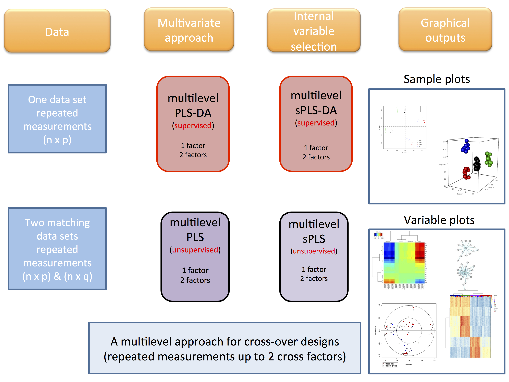

```{r global_options, include=FALSE}
library(knitr)
knitr::opts_chunk$set(dpi = 100, echo= TRUE, warning=FALSE, message=FALSE, fig.align = 'center', 
                      fig.show=TRUE, fig.keep = 'all', out.width = '50%') 
```

In order to take into account the complex structure of repeated measurements from different assays where different treatments are applied on the same subjects, we developed a multilevel multivariate approach combined with our PLS models to highlight the treatment effects within subject separately from the biological variation between subjects (collaboration with A/Prof. B. Liquet).

Two different frameworks are proposed:

**1.** A discriminant analysis (*method = ‘splsda’*) enables the selection of features separating the different treatments

**2.** An integrative analysis  (*method = ‘spls’*) enables the interaction of two matched data sets and the selection of subsets of correlated variables (positively or negatively) across the samples. The approach is unsupervised: no prior knowledge about the samples groups is included.

The multilevel function first decomposes the variance in the data sets X (and Y for sPLS) and applies either sPLS-DA or sPLS on the within-subject variation matrix (see Westerhuis et al. 2010; Liquet et al, 2012). One- or two-factor analyses are available for sPLS-DA. A two factor analysis include two factors that are repeated for the same samples (see below and our case studies).

```{r, echo = FALSE}

```


# Usage in mixOmics

```{r}
library(mixOmics)
data(vac18)
X <- vac18$genes
Y <- vac18$stimulation

# sample indicates the repeated measurements
# setup the design matrix by indicating the repeated measurements
design <- data.frame(sample = vac18$sample)

# multilevel sPLS-DA model with specific input parameters of our choice
vac18.splsda.multilevel <- splsda(X, 
                                  Y = vac18$stimulation, 
                                  multilevel = design, 
                                  ncomp = 3, 
                                  keepX = c(30, 137, 123))
```

## How do I know I need a multilevel analysis?

- Firstly, the data have a repeated design, either across a few time points (before / after a treatment), or across different body sites (microbiome sampled for the same individuals but at different locations of the body). A simple check that your individual samples (their ID) are indeed repeated more than once indicate that a multilevel decomposition can be considered: 
```{r}
summary(as.factor(vac18$sample))
```

- Secondly, a multilevel decomposition is adequate when the individual variation is much greater than the treatment / repeated measures variation. This translates into samples belonging to the same unique individual clustering together on a PCA plot irrespective of time or repetitions. In that case a multilevel decomposition will help unravelling subtle differences hidden by individual variation. The example below shows that most individuals (indicated with their individual IDs) cluster together.

```{r}
pca.result <- pca(vac18$genes)
plotIndiv(pca.result, ind.names = vac18$sample, group = vac18$sample)
```

## Variable Selection

A tuning function **tune.spslda** with a multilevel decomposition can be used to tune the number of variables to select for either an sPLS-DA or an sPLS multilevel model. The tune function returns the optimal number of *keepX* variables to select (see also **?tune.splsda**)

**1.** Example for one-factor analysis with sPLS-DA using leave-one-out cross validation. 

```{r}
tune.loo.vac18 <- tune.splsda(X, Y, 
                                multilevel = vac18$sample,
                               ncomp=2,
                               test.keepX=c(5, 10, 15), 
                               dist = 'mahalanobis.dist',
                               validation = 'loo',
                               progressBar = FALSE) # hide the progress bar
tune.loo.vac18$choice.keepX
# see also tune.loo.vac18
```

**2.** Example for two-factor analysis with sPLS-DA. In that case the multilevel decomposition is not straighforward and we cannot output the classification error rate of the mode. We therefore only output the correlation between the latent components, for each keepX value. 


```{r}
# Two factor analysis with sPLS-DA
data("liver.toxicity")

dose <- as.factor(liver.toxicity$treatment$Dose.Group)
time <- as.factor(liver.toxicity$treatment$Time.Group)

# note: we made up those data, pretending they are repeated measurements

repeat.indiv <- c(1, 2, 1, 2, 1, 2, 1, 2, 3, 3, 4, 3, 4, 3, 4, 4, 5, 6, 5, 5,
                    6, 5, 6, 7, 7, 8, 6, 7, 8, 7, 8, 8, 9, 10, 9, 10, 11, 9, 9,
                    10, 11, 12, 12, 10, 11, 12, 11, 12, 13, 14, 13, 14, 13, 14,
                    13, 14, 15, 16, 15, 16, 15, 16, 15, 16)

# check a multilevel design is ok:
summary(as.factor(repeat.indiv)) # 16 rats, 4 measurements each
# the following table shows the two factors, 
table(time, dose)
# see also table(repeat.indiv, dose) and table(repeat.indiv, time) 
# to better understand the design

# we indicate the repeated measurements, or unique sample ID
design <- data.frame(sample = repeat.indiv)

# in the sPLSDA model we want to discriminate both dose and time
liver.tune <- tune.splsda(liver.toxicity$gene,
                             Y = data.frame(dose, time),
                             multilevel = design,
                             ncomp=2,
                             test.keepX=c(5, 10, 150),
                             dist = 'mahalanobis.dist',
                              progressBar = FALSE)  # hide the progress bar

liver.tune  # outputs the correlation
```

# Case study
See the [Case Study: Multilevel vac18](http://mixomics.org/case-studies/multilevelvac18/) for more tuning details and plotting options. 


# References

Westerhuis, J. A., van Velzen, E. J., Hoefsloot, H. C., and Smilde, A. K. (2010). Multivariate paired data analysis: multilevel PLSDA versus OPLSDA. Metabolomics, 6(1), 119-128.

[Liquet, B., Lê Cao, K.A., Hocini, H. and Thiébaut, R., 2012. A novel approach for biomarker selection and the integration of repeated measures experiments from two assays. BMC bioinformatics, 13(1), p.325.](https://bmcbioinformatics.biomedcentral.com/articles/10.1186/1471-2105-13-325)