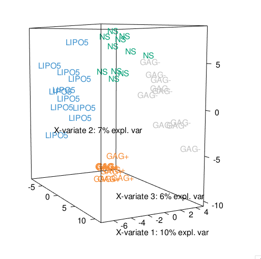

```{r global_options, include=FALSE}
library(knitr)
knitr::opts_chunk$set(dpi = 100, echo= TRUE, warning=FALSE, message=FALSE, #dev = 'jpeg',
                      fig.show=TRUE, fig.keep = 'all', fig.height= 8, fig.width=9)

```

# Case study with Multilevel on Vac18 data set

Here, we illustrate multilevel PCA using the vac18 data set, see ?vac18. The vac18 data set is a subset of the data from [2] who assessed a vaccine based on HIV-1 lipopeptides in HIV-negative volunteers. The vaccine (HIV-1 LIPO-5 ANRS vaccine) contains five HIV-1 amino acid sequences coding for Gag, Pol and Nef proteins.

A multilevel multivariate approach is implemented in mixOmics to take into account the complex structure of repeated measurements from different assays, where different treatments are applied on the same biological samples and at different time points [1]. The multilevel approach aims at highlighting the treatment effects within subject separately from the biological variation between biological samples.

The multilevel function first decomposes the within from the between variance in the data sets X (and Y ) via the internal functions withinVarition(). Once the within variance is calculated, we can run the classical multivariate approaches, such as PCA, PLS-DA and PLS on the within- subject deviation.

## Two frameworks are proposed...

[1] A discriminant analysis ( method = “splsda” ) which enables the selection of features separating the different treatments (indicated by the vector or the matrix argument design ). This approach performs a supervised analysis.

[2] An integrative analysis ( method = “spls” ) of two matched data sets, which enables the selection of a subset of (positively or negatively) correlated variables across the samples from both sets. The approach is unsupervised as no prior knowledge about the samples groups is included in the analysis.

# To begin...

Load the latest version of [mixOmics](https://www.rdocumentation.org/link/%20www.mixOmics.org%2FmixMC?package=mixOmics&version=6.0.0).

```{r}
library(mixOmics)
```

# Data

The multilevel Vac18 data set is implemented in **mixOmics** via vac18, and contains the following:

The vac18 dataset contains the following:

**$gene:** a data frame with 42 rows and 1,000 columns representing the expression measure of
2,500 genes for the 42 samples (PBMC cells from 12 unique subjects).
<br>
<br>
**$stimulation:** a factor of 42 elements indicating the type of in vitro stimulation for each sample (4 classes in total).
<br>
<br>
**$sample:** a vector of 42 elements indicating the unique subjects (for example the value ’1’ corresponds to the first patient PBMC cells). Note that the design of this study is unbalanced.
<br>
<br>
**$tab.prob.gene:** data frame with 2,500 rows and 2 columns indicating the Illumina probe ID and the gene name of the annotated genes.

```{r}
data(vac18)
X <- vac18$genes
#the treatments
summary(vac18$stimulation)
#the number of repeated measurements per individual
summary(as.factor(vac18$sample))
```

# Preliminary analysis with PCA

As a preliminary step, we first apply a multilevel PCA, which is a PCA applied on the within-subject deviation matrix that is calculated internally to the method by specifying *multilevel = design*, where design indicated the unique samples (or subject ID) on which the stimulations are repeated.

```{r}
design <- data.frame(sample = vac18$sample)
pca.multilevel.vac18 <- pca(X, ncomp = 3, scale = TRUE, center = TRUE, 
                            multilevel = design)
pca.multilevel.vac18
```

For comparison purposes, we will also apply a PCA on the original X data set. Note: this is not appropriate since PCA makes the assumption that all samples are independent and is for comparison purposes only.

```{r}
pca.classic.vac18 <-pca(X, ncomp = 3, scale = TRUE, center = TRUE)
pca.classic.vac18
```

# Sample Plots

Below is a visual example illustrating the benefits of the multilevel approach. With a classical PCA, we see clusters according to the biological samples, rather than the treatments. On the contrary, the multilevel PCA accommodate for the individual variability. As a result, a clustering of the stimulation LIPO5/GAG+ vs. GAG-/NS can be observed.

```{r}
plotIndiv(pca.classic.vac18, ind.names = vac18$stimulation, 
          group = vac18$stimulation,
          title = 'VAC18, classical PCA, comp 1 - 2')
```

```{r}
plotIndiv(pca.multilevel.vac18, , ind.names = vac18$stimulation, 
          group = vac18$stimulation,
          title = 'VAC18, PCA multilevel, comp 1 - 2')
```

# Multilevel PLS-DA

The aim of this analysis is to select the genes that can discriminate the four types of stimulation (one level analysis) by taking into account the design of the experiment (i.e. 4 repeated measurements on each subject).The PLS-DA and sPLS-DA analyses below will help refine the clusters of samples in a supervised fashion. For a supervised analysis, Y is a factor indicating the class membership of each tumor.


```{r}
# classical PLS-DA
vac18.plsda <- plsda(X, Y = vac18$stimulation, ncomp = 3)

# multilevel PLS-DA
vac18.plsda.multilevel <- plsda(X, Y = vac18$stimulation, multilevel = design, ncomp = 3)
```

# Sample Plots

```{r}
# numbers here indicate the ID of the individuals
plotIndiv(vac18.plsda, ind.names = vac18$sample,
          group = vac18$stimulation, 
          legend = TRUE,
          title = 'VAC18, classical PLS-DA, comp 1 - 2')
```

```{r}
plotIndiv(vac18.plsda.multilevel, ind.names = vac18$sample,
          group = vac18$stimulation, 
          legend = TRUE,
          title = 'VAC18, multilevel PLS-DA, comp 1 - 2')
```

While both approaches highlight a good separation of the stimulation, the clustering is clearer on the multilevel PLS-DA approach.

# Multilevel sPLS-DA

sPLS-DA performs variable selection and classification in a one step procedure. sPLS-DA is a special case of sparse PLS, see [sPLS-DA method](http://mixomics.org/methods/splsa-da/) or [sPLS-DA case study](http://mixomics.org/case-studies/spls-da-srbct-2/).

In [1] we have thoroughly tuned the keepX parameter, where we selected keepX = c(30, 137, 123). For details on the tuning step to choose the number of variables to keep, see [sPLS-DA case study](http://mixomics.org/case-studies/spls-da-srbct-2/).

```{r}
vac18.splsda.multilevel <- splsda(X, Y = vac18$stimulation,
                                  multilevel = design, 
                                  ncomp = 3, 
                                  keepX = c(30, 137, 123))
```

# Sample Plots

```{r eval=FALSE}
plotIndiv(vac18.splsda.multilevel, ind.names = vac18$stimulation, col = color.mixo(c(vac18$stimulation)), style = '3d')
```



The 3D sample plot shows a good separation of the different stimulations using sPLS-DA.

A heatmap representation of the probes selected in all dimensions can be obtained via our function **cim()** function

```{r}
col.ID <- c("lightgreen", "red", "lightblue", "darkorange",
              "purple", "maroon", "blue", "chocolate", "turquoise",
              "tomato1", "pink2", "aquamarine")[vac18$sample]

cim(vac18.splsda.multilevel, 
    row.sideColors = cbind(color.mixo(c(vac18$stimulation)), col.ID),
    row.names = paste(vac18$stimulation, vac18$sample, sep = "_"),
    col.names = FALSE, legend=list(legend = c(levels(vac18$stimulation)), 
    col = c(color.mixo(1:4)),
    title = "Stimulation", cex = 0.8))
```

## To go further with multilevel analysis…

# Multilevel PLS on artificial liver toxicity repeated measures data set

An integrative multilevel approach is also feasible as long as the same samples are measured in both data sets. The within variance matrices are internally calculated in the function spls(). As an illustrative example, we have created an artificial repeated measures data set using the liver.toxicity study described in 9. Each sample is repeated 4 times. By default the PLS approach is run with a canonical mode and is an unsupervised approach. Here we want to integrate genes and clinical measurements with a sPLS. The design matrix only includes the repeated measurement information.

# Data 

```{r}
data(liver.toxicity)
# note: we made up those data, pretending they are repeated measurements
repeat.indiv <- c(1, 2, 1, 2, 1, 2, 1, 2, 3, 3, 4, 3, 4, 3, 4, 4, 5, 6, 5, 5,
                  6, 5, 6, 7, 7, 8, 6, 7, 8, 7, 8, 8, 9, 10, 9, 10, 11, 9, 9,
                  10, 11, 12, 12, 10, 11, 12, 11, 12, 13, 14, 13, 14, 13, 14,
                  13, 14, 15, 16, 15, 16, 15, 16, 15, 16)
summary(as.factor(repeat.indiv)) # 16 rats, 4 measurements each
```

The multilevel sPLS model with a selection of 50 genes on each component and 5 clinical variables. In [1] an ad-hoc tuning strategy is used based on the maximisation of the correlation between the latent variables using cross-validation (see **?tune.multilevel**).

```{r}
design <- data.frame(sample = repeat.indiv)
  
tune.liver = tune.multilevel(X = liver.toxicity$gene, Y = liver.toxicity$clinic, 
                                multilevel = design,
                                mode = 'canonical',
                                ncomp=2,
                                test.keepX=c(5, 10, 15), 
                                test.keepY=c(2,3), 
                                already.tested.X = c(50), already.tested.Y = c(5),
                                method = 'spls') 
```

```{r}
toxicity.spls.multilevel <- spls(X = liver.toxicity$gene,
                                    Y=liver.toxicity$clinic,
                                    multilevel = design,
                                    ncomp = 3,
                                    keepX = c(50, 50, 50), 
                                    keepY = c(5, 5, 5),
                                    mode = 'canonical')
```

# Plots

The usual graphical outputs can be obtained, as indicated below:

```{r}
plotVar(toxicity.spls.multilevel, comp = 1:2, var.names = TRUE, cex = c(2,2)) 
```

```{r}
stim.col <- c("darkblue", "purple", "green4","red3")
# showing only the Y variables, and only those selected in comp 1 
cim(toxicity.spls.multilevel, mapping="Y", comp = 1,
     row.sideColors = stim.col[factor(liver.toxicity$treatment[,3])], 
     #setting up legend:
     legend=list(legend = unique(liver.toxicity$treatment[,3]), col= stim.col, 
     title = "Dose", cex=0.9))
```

# References

1. [Liquet, B., Lê Cao, K.-A., Hocini, H., and Thiébaut, R. (2012). A novel approach for biomarker selec- tion and the integration of repeated measures experiments from two assays. BMC bioinformatics, 13, 325.](http://bmcbioinformatics.biomedcentral.com/articles/10.1186/1471-2105-13-325)

2. [Sanou, M. P., De Groot, A. S., Murphey-Corb, M., Levy, J. A., and Yamamoto, J. K. (2012). Hiv-1 vaccine trials: evolving concepts and designs. The open AIDS journal, 6, 274.](https://benthamopen.com/contents/pdf/TOAIDJ/TOAIDJ-6-274.pdf)

