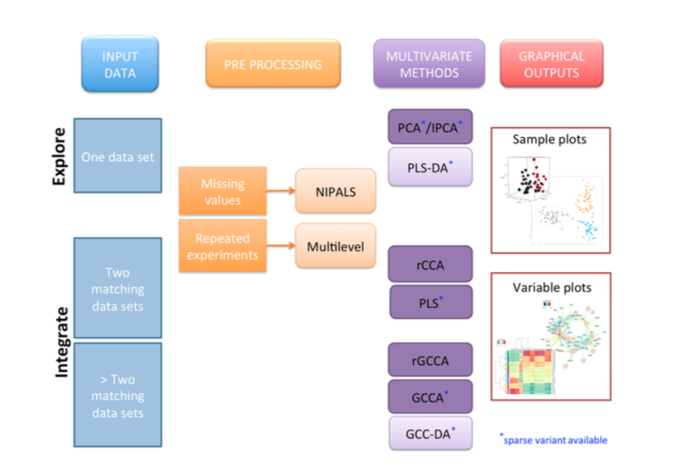

```{r global_options, include=FALSE}
library(knitr)
knitr::opts_chunk$set(dpi = 100, echo= TRUE, warning=FALSE, message=FALSE, #dev = 'jpeg',
                      fig.show=TRUE, fig.keep = 'all', fig.height= 8, fig.width=9)
```

# Methods

Depending on the biological question you are asking, one or several methodologies can be applied. Below are listed some typical analysis frameworks.

We call **variables** the expression or abundance of entities that are measured (genes, metabolites, proteins, SNP, ...) and **samples  or observations or units** an individual, a patient, a cell on which the experiment is performed.

In **mixOmics** the data should be with samples in rows and variables in columns.




# Using MixOmics

In mixOmics we propose a whole range of multivariate methods that we developed and validated on many biological studies.

## Exploring one single data set (e.g. transcriptomics data set)

Principal Component Analysis (PCA)

sparse Principal Component Analysis (sPCA)

## Integrating two data sets measured on the same individuals/samples (e.g. transcriptomics and proteomics data)

Canonical Correlation Analysis (CCA)

regularized Canonical Correlation Analysis (rCCA)

Partial Least Squares (PLS)

sparse Partial Least Squares (sPLS)

## Classifying different groups of samples according to a discrete outcome

PLS-Discriminant Analysis (PLS-DA)

sparse PLS-DA (sPLS-DA)

## Estimating missing values in the data

Most of the multivariate methods in mixOmics can be performed with missing values.

## Analysing repeated measurement or a cross-over design

A multilevel argument is available in most mixOmics methods for this specific experimental design.

# mixOmics Philosophy 

The multivariate statistical methods implemented in **mixOmics** aim at summarizing the main characteristics of the data while capturing the largest sources of variation in the data. Multivariate methods are mostly considered as ‘exploratory’ methods as they do not enable statistical inference, however, the biological question matters in order to apply the suitable multivariate method.

# Frequenlty asked questions include...

#### Q. I would like to identify the trends or patterns in your data, experimental bias or, identify if your samples ‘naturally’ cluster according to the biological conditions...

A. Principal Component Analysis (PCA)

#### Q. In addition to the above, I would like to select the variables that contribute the most to the variance in the data set...
A. sparse Principal Component Analysis (sPCA)

#### Q. I would like to know if I can extract common information from the two data sets (or highlight the correlation between the two data sets) The total number of variables is less than the number of samples: 
A. Canonical Correlation Analysis (CCA) or Partial Least Squares (PLS) canonical mode

#### Q. The total number of variables is greater than the number of samples... 

A. Regularized Canonical Correlation Analysis (rCCA) or Partial Least Squares (PLS) canonical mode.

#### Q. I would like to model a uni-directional relationship between the two data sets, i.e. I would like to predict the expression of the metabolites (Y) given the expression of transcripts (X). In addition to the above, I would like to select the variables from both data sets that covary (i.e. ‘change together’) across the different conditions...

A. sparse Partial Least Squares (sPLS) with appropriate mode or Partial Least Squares (PLS), classic or regression mode

#### Q. I have one single data set (e.g. microarray data) and I am interested in classifying my samples into known classes and I would like to know how informative my data are to rightly classify my samples, as well as predicting the class of new samples...

A. PLS-Discriminant Analysis (PLS-DA)

#### Q. In addition to the above, I would like to select the variables that help classifying the samples..

A. sparse PLS-DA (sPLS-DA)

#### A. I have one single data set (e.g. microarray data) and I have one continuous response variable or outcome for each sample. I would like to predict the response with my data.

A. Here X = expression data and Y = response vector.

#### Q. I would like to model a causal relationship between my data and the response vector and assess how informative my data are to predict such response...

A. PLS-regression mode

#### Q. In addition to the above, I would like to select the variables that best predict the response...

A. sparse PLS-regression mode
