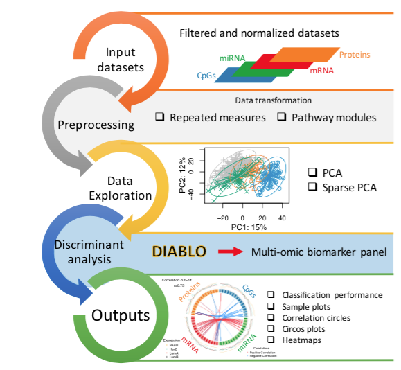
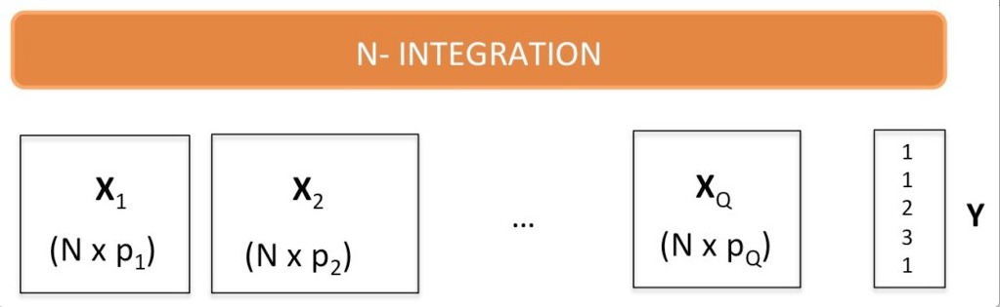

```{r global_options, include=FALSE}
library(knitr)
knitr::opts_chunk$set(dpi = 100, echo= FALSE, warning=FALSE, message=FALSE, #dev = 'jpeg',
                      fig.show=TRUE, fig.keep = 'all', fig.width= 6)
```

**mixDIABLO** is a novel mixOmics framework for the integration of multiple data sets in a supervised analysis. DIABLO stands for Data Integration Analysis for Biomarker discovery using Latent variable approaches for Omics studies.

```{r, out.width = "400px"}

```

# Context

The integration of multiple ‘omics data sets is topical to study biological systems. Such analysis aims to extract complementary information from several data sets measured on the same N individuals (or biological samples) but across multiple data sets generated using different (omics) platforms, to gain a better understanding of the interplay between the different levels of data that are measured. We call our generic framework ‘N-integration‘.

```{r, out.width = "400px"}

```

# Background

The core DIABLO method builds on the Generalised Canonical Correlation Analysis [1], (R package RGCCA) which contrary to what its name suggests, generalises PLS for multiple matching datasets,  and the sparse sGCCA method [2]. The aim is to identify correlated (or co-expressed) variables measured on heterogeneous data sets which also explain the categorical outcome of interest (supervised analysis). The multiple data integration task is not easy, as the analysis can be strongly affected by the variation between manufacturers or ‘omics technological platforms despite being measured on the same biological samples.

In a preliminary study [3] we integrated transcriptomics and proteomics data in a kidney rejection study, while explaining the rejection status of the patients.

# mixDIABLO method

We further extended sGCCA for Discriminant Analysis, substantially improved the  R code and developed innovative graphical outputs to interpret the DIABLO results, which we present in the next page (see tabs).

Our [manuscript](https://scholar.google.com/scholar_url?url=http://www.biorxiv.org/content/biorxiv/early/2016/08/03/067611.full.pdf&hl=en&sa=T&oi=gsb-gga&ct=res&cd=0&ei=9PJFWKrBEZCxmAGFmYKQBg&scisig=AAGBfm3iG_i1eg3qvaDrd8JOciOvicXIRw) is a collaborative work between the core team (Drs Florian Rohart, Kim-Anh Lê Cao), key contributors (Amrit Singh, Benoît Gautier) as a result of a long term collaboration with University of British Columbia. Feel free to contact us at mixomics [at] math.univ-toulouse.fr if you have any questions.

# References

1. [Tenenhaus A and Tenenhaus M. Regularized generalized canonical correlation analysis. Psychometrika, 76(2):257–284, 2011.](https://scholar.google.com/scholar_url?url=http://link.springer.com/content/pdf/10.1007/s11336-011-9206-8.pdf&hl=en&sa=T&oi=gsb-gga&ct=res&cd=0&ei=XPRFWN3rI4usmgGYqLLIAw&scisig=AAGBfm3WYBoB2Oc9bz2p421LrWGtWR-aXQ)

2. [Tenenhaus A, Philippe C, Guillemot V, Lê Cao, K. A., Grill J, and Frouin V. Variable selection for generalized canonical correlation analysis. Biostatistics, page kxu001, 2014.](https://scholar.google.com/scholar_url?url=http://biostatistics.oxfordjournals.org/content/early/2014/02/17/biostatistics.kxu001.full&hl=en&sa=T&oi=gsb-gga&ct=res&cd=0&ei=F_ZFWPCsFcP6mAGS6YawDA&scisig=AAGBfm0XGUBbNdZDNf8JZPSgexvXLpsRcQ)

3. [Günther OP, Shin H, Ng RT, McMaster WR, McManus BM, Keown PA, Tebbutt SJ, and Lê Cao, K. A.. Novel multivariate methods for integration of genomics and proteomics data: applications in a kidney transplant rejection study. Omics: a journal of integrative biology, 18(11):682–695, 2014.](https://scholar.google.com/scholar_url?url=http://online.liebertpub.com/doi/full/10.1089/omi.2014.0062&hl=en&sa=T&oi=gsb-gga&ct=res&cd=0&ei=PvZFWLqMKsP6mAGS6YawDA&scisig=AAGBfm1Uv1VFxI8lWda-qANa8Y6LOhc3rQ)

4. [Singh, A., Gautier, B., Shannon, C.P., Vacher, M., Rohart, F., Tebutt, S.J. and Le Cao, K.A., 2016. DIABLO-an integrative, multi-omics, multivariate method for multi-group classification. bioRxiv, p.067611.](https://scholar.google.com/scholar_url?url=http://www.biorxiv.org/content/biorxiv/early/2016/08/03/067611.full.pdf&hl=en&sa=T&oi=gsb-gga&ct=res&cd=0&ei=9PJFWKrBEZCxmAGFmYKQBg&scisig=AAGBfm3iG_i1eg3qvaDrd8JOciOvicXIRw)