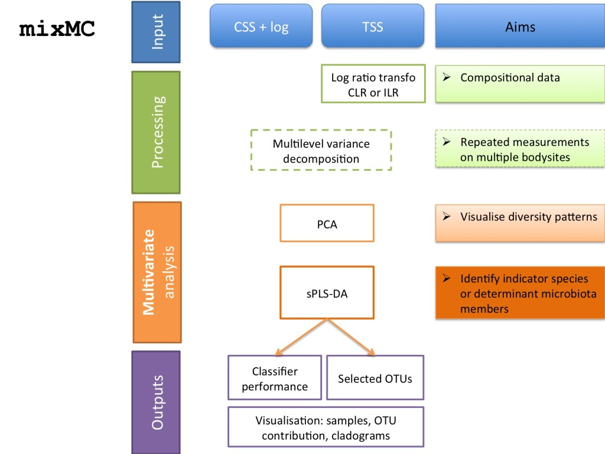

[**mixMC**](http://journals.plos.org/plosone/article/metrics?id=10.1371/journal.pone.0160169) is a multivariate framework implemented in **mixOmics** for microbiome data analysis. The framework takes into account the inherent characteristics of microbiome data, namely sparsity (large number of zeroes in the data) and compositionality (resulting from the scaling we use to account for uneven sequencing depth per sample). The **mixMC** framework aims at identifying key microbial communities associated with their habitat or environment.  

**mixMC** addresses the limitations of existing multivariate methods for microbiome studies and proposes unique analytical capabilities: it handles compositional and sparse data, repeated-measures experiments and multiclass problems; it highlights important discriminative features, and it provides interpretable graphical outputs to better understand the microbial communities contribution to each habitat. The framework from our paper is summarised below:

<br>

<br>

# To get started

Load the latest version of [mixOmics](https://cran.r-project.org/web/packages/mixOmics/index.html).

```{r echo=TRUE, warning=TRUE, message=FALSE}
library(mixOmics)
```


# Data
In the tabs under mixMC, examples are provided applying mixMC to microbiome 16S data sets. The data are directly available through the mixOmics package. If you would like to download the **full data sets**  and the associated R scripts used for the paper, then click on the following links:

[Non-Repeated Measures analysis with the Koren data set ](http://mixomics.org/wp-content/uploads/2017/01/Koren.zip)


[Repeated Measures analysis with the HMP most diverse body sites](http://mixomics.org/wp-content/uploads/2016/12/HMB.zip)

[Repeated Measures with the HMP Oral body sites 16S](http://mixomics.org/wp-content/uploads/2016/12/Oral.zip)


# How does mixMC fit into mixOmics?

**mixMC** is a pipeline we set up for microbial communities, using some of our standards methods in mixOmics but with a bit of tweaking. The method sPLS-DA has been improved with CLR transformation and includes a multilevel decomposition for repeated measurements design that are commonly encountered in microbiome studies. The multilevel approach we developed in [4] enables the detection of subtle differences when high inter-subject variability is present due to microbial sampling performed repeatedly on the same subjects but in multiple habitats. To account for subject variability the data variance is decomposed into*within variation* (due to habitat) and *between subject variation* [5], similar to a within-subjects ANOVA in univariate analyses. 

As part of the pipeline we added the new graphical output **plotLoadings** to visualise the OTUs selected by sPLSDA on each component and the sample group or habitat in which the OTU is most (or least) abundant. See examples in our other tabs. 


# What is new? What is next?
In collaboration with collaborators from INRA Toulouse, France we are in the process of linking with the R package **mixKernel** to integrate different types of data using kernel models ([see here](http://mixomics.org/mixkernel/)).

We are currently developing new multivariate methods for microbiome data analysis, so watch this space!


# References 
1. [Lê Cao KA, Costello ME, Lakis VA, Bartolo F, Chua XY, et al. (2016) MixMC: A Multivariate Statistical Framework to Gain Insight into Microbial Communities. PLOS ONE 11(8): e0160169. doi: 10.1371/journal.pone.0160169](http://journals.plos.org/plosone/article/metrics?id=10.1371/journal.pone.0160169)

2. [Aitchison, J., 1982. The statistical analysis of compositional data. Journal of the Royal Statistical Society. Series B (Methodological), pp.139-177.](https://scholar.google.com/scholar_url?url=http://www.jstor.org/stable/2345821&hl=en&sa=T&oi=gsb-gga&ct=res&cd=1&ei=bZ43WIeXNoLijAGxrrvwCw&scisig=AAGBfm29rId6wbzZnTe7T-ST4HCF0U4O4g)


3. [Filzmoser, P., Hron, K. and Reimann, C., 2009. Principal component analysis for compositional data with outliers. Environmetrics, 20(6), pp.621-632.](https://scholar.google.com/scholar_url?url=https://www.researchgate.net/profile/Peter_Filzmoser/publication/227528968_Principal_component_analysis_of_compositional_data_with_outliers/links/09e4151129a8c792bd000000.pdf&hl=en&sa=T&oi=gsb-gga&ct=res&cd=0&ei=qp43WMCHEouOjAGZ6Z-4Aw&scisig=AAGBfm1mB8frALUL699TNp-vVgk-XzGhOg)


4. [Liquet, B., Lê Cao, K.A., Hocini, H. and Thiébaut, R., 2012. A novel approach for biomarker selection and the integration of repeated measures experiments from two assays. BMC bioinformatics, 13(1), p.325.](https://scholar.google.com/scholar_url?url=http://www.biomedcentral.com/1471-2105/13/325&hl=en&sa=T&oi=gsb-gga&ct=res&cd=0&ei=4J43WPDdCMP82Aa6qLzQCQ&scisig=AAGBfm1OpbHVWALILoWtXKl7p-iQKRe5Mg)

5. [Westerhuis, J.A., van Velzen, E.J., Hoefsloot, H.C. and Smilde, A.K., 2010. Multivariate paired data analysis: multilevel PLSDA versus OPLSDA. Metabolomics, 6(1), pp.119-128.](https://scholar.google.com/scholar_url?url=http://link.springer.com/article/10.1007/s11306-009-0185-z/fulltext.html&hl=en&sa=T&oi=gsb-gga&ct=res&cd=0&ei=xJ43WMGWNI6SjAHp3L6IAg&scisig=AAGBfm00SN6xghGwtNv5b5VZOxADOblHDQ)   

