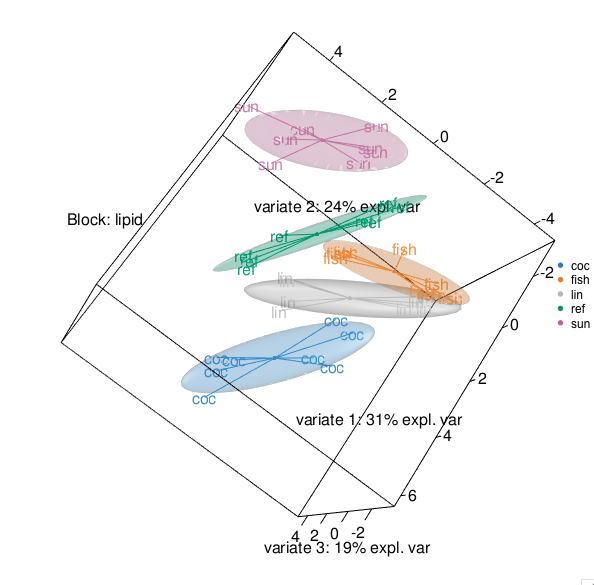

```{r global_options, include=FALSE}
library(knitr)
knitr::opts_chunk$set(dpi = 100, echo= TRUE, warning=FALSE, message=FALSE, fig.align = 'center', 
                      fig.show=TRUE, fig.keep = 'all', out.width = '50%') 
```

# plotIndiv

# Sample representation

In this plot the samples are represented as points placed according to their projection in the smaller subspace spanned by the components (or latent variables) of our multivariate models. They enable to visualise similarities (points are clustered) and dissimilarities between samples. 

## Sample plots for integrative methods
For rCCA, PLS, DIABLO. block.pls, block.plsda and mint methods, we obtain a set of components per data set. We can therefore visualise samples from separate data sets as they can be plotted on separate figures, allowing to assess the agreement between the data sets at the sample level. 


## Sample plots for supervised methods
For PLS-DA, DIABLO. block.plsda and mint.plsda methods, confidence ellipse plots for each class can be displayed. To visualise the prediction areas of each class, users can overlay prediction results to sample plots via the background input parameter (see Rahart et al 2017b). The method define surfaces around samples that belong to the same predicted class. These surfaces are then be used to shade the background of the sample plot, see more details in **?background.predict** (currently only for single ‘omics analysis plsda and splsda with no more than 2 dimensions).

# Usage in mixOmics

Individual 2D and 3D plots can be obtained in mixOmics via the function **plotIndiv** as displayed below.

## Example of PCA sample plot
Here is an example with PCA on the nutrimouse lipid data. PCA is unsupervised but we can color the samples in the plot according to some phenotype, here the genotype information.

```{r}
library(mixOmics)
data(nutrimouse)
X = nutrimouse$lipid
pca.res = pca(X, ncomp = 3)
plotIndiv(pca.res, group = nutrimouse$genotype, legend = TRUE, title = 'PCA, ggplot')
# use the comp = c(1,3) argument to plot the first and third component
```

Other graphics style are available. The graphics style offers more flexibility.

```{r}
plotIndiv(pca.res, group = nutrimouse$genotype, title = 'PCA, lattice style', style = 'lattice')
plotIndiv(pca.res, group = nutrimouse$genotype, title = 'PCA, graphics style', style = 'graphics')
```


## Example with an integrative model (N-integration)
Samples from each data set, or block is represented in its own space spanned by its own set of components. Here we integrate the lipid and gene expression data from nutrimouse and represent the samples with symbols. PCA is unsupervised but we  color the samples in the plot according to  the genotype information.

```{r}
Y <- nutrimouse$gene
rcca.res <- rcc(X, Y, ncomp = 3, lambda1 = 0.064, lambda2 = 0.008)

plotIndiv(rcca.res, group = nutrimouse$genotype, ind.names = FALSE,
          legend = TRUE, title = 'rCCA')
```     

Alternatively, we can represent the sample in the 'common' subspace between the two sets of components. Note that this option is only available for two datasets integration method (rCCA and PLS), see **?plotIndiv**.

```{r}
plotIndiv(rcca.res, group = nutrimouse$genotype, ind.names = FALSE,
          legend = TRUE, title = 'rCCA XY-space', rep.space = 'XY-variate')
```


## Example with a supervised model
Here we discriminate the diet groups with a PLS-DA model on the lipid expression data in nutrimouse. By default colors will be assigned to the different sample groups. Here is an example with confidence ellipse plots.

Note that the explained variance in a PLSDA plot might be < the variance explain in a PCA and this is totally expected: the PCA aims to maximise the variance explained per component, while the PLSDA aims to maximise the discrimination per component!

```{r}
outcome <- nutrimouse$diet
##plot.ellipse and ellipse.level
plsda.res <- plsda(X, outcome, ncomp = 3)
    
plotIndiv(plsda.res, ind.names = FALSE, legend = TRUE, ellipse = TRUE,
          title = 'PLS-DA')
```


As we detail in Rohart et al. (2017b) (main article and suppl info) the prediction area can be visualised by calculating a background surface first, before overlaying the sample plot. Such plot visualises the effect of the different prediction distances, **?background.predict** and our supp material for more details. The prediction distance needs to be specified to calculate the background area.

```{r}
# may take a couple of min to run
background <- background.predict(plsda.res, comp.predicted=2, dist = 'mahalanobis.dist',
                                 ylim = c(-6,6))  # #optional ylim and xlim, or increase resolution

plotIndiv(plsda.res, ind.names = FALSE, legend = TRUE, ellipse = TRUE,
          title = 'PLS-DA with prediction dist background', background = background)
```


## Example of a 3D representation
Visualisation in 3D of the rCCA analysis that was run on 3 components. The plot is actually interactive.


```{r, eval=FALSE}
plotIndiv(rcca.res, 
          group = nutrimouse$diet, 
          ind.names = nutrimouse$diet,
          legend =TRUE, 
          ellipse = TRUE, 
          rep.space = 'XY-variate',
          title = '3D-Nutrimouse',
          star = TRUE, 
          centroid = TRUE,
          style='3d')
#library('rgl')
#rgl.snapshot('Images/3d_nutrimouse.png')  # to save
```

<!-- [Nutrimouse 3D-Plot](Images/3d_nutrimouse.png) -->
```{r, include = FALSE}

```


## Example with P-integration (MINT)
When we integrate independent studies, a sample plot is output for each study, or all studies altogether, see Rohart et al., 2017a.

```{r}
data(stemcells)
mint.res <- mint.splsda(X = stemcells$gene, Y = stemcells$celltype, ncomp = 2, keepX = c(10, 5),
study = stemcells$study)

#plot study-specific outputs for all studies
plotIndiv(mint.res, study = "all.partial", legend = TRUE)

#plot study-specific outputs for study "2"
#plotIndiv(mint.res, study = "2")
```

# Case studies
 See our case studies as well as the mixMC, DIABLO and MINT tabs.
 
# References

[Rohart F, Gautier B, Singh A, Lê Cao K-A (2017b). mixOmics: an R package for 'omics feature selection and multiple data integration.](http://mixomics.org/a-propos/publications/)

[Rohart F.,  Matigian N., Eslami A., Bougeard S and Lê Cao, K-A (2017a). MINT: A multivariate integrative method to identify reproducible molecular signatures across independent experiments and platforms *BMC Bioinformatics* 18:128.](https://bmcbioinformatics.biomedcentral.com/articles/10.1186/s12859-017-1553-8)