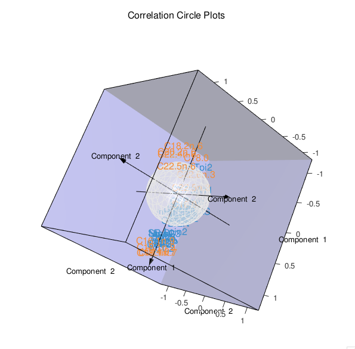

```{r global_options, include=FALSE}
library(knitr)
knitr::opts_chunk$set(dpi = 100, echo= TRUE, warning=FALSE, message=FALSE, #dev = 'jpeg',
                      fig.show=TRUE, fig.keep = 'all', fig.height= 8, fig.width=9)
```

# plotVar

## Variables representation

In this type of graphical display, the variables X and Y are represented through their projections onto the plane defined either by X-variates or Y-variates. The variables X and Y being assumed to be of unit variance, their projections are inside a circle of radius 1 centered at the origin called correlation circle. Strongly associated (or correlated) variables are projected in the same direction from the origin. The greater the distance from the origin the stronger the association. Two circumferences of radius 1 and 0.5 are plotted to reveal the correlation structure of the variables.

Note that this function also works for the case when there is a single data set (using a (s)PCA or a (s)PLS-DA result).

# Usage in mixOmics

Variables 2D plots can be obtained in mixOmics via the function plotVar as displayed below:

```{r}
library(mixOmics)
```


```{r}
#pls/spls
data(liver.toxicity)
X <- liver.toxicity$gene
Y <- liver.toxicity$clinic
toxicity.spls <- spls(X, Y, ncomp = 3,
keepX = c(30, 30, 30), keepY = c(10, 10, 10))

#test overlap
plotVar(toxicity.spls,overlap = F)
```
    
```{r}
#rcc
data(linnerud)
X <- linnerud$exercise
Y <- linnerud$physiological
linn.res <- rcc(X, Y)

#test rad.in
plotVar(linn.res,rad.in=0.9)
```

```{r}
#pca/spca
data(liver.toxicity)
rat.spca <- spca(liver.toxicity$gene, ncomp = 3, keepX = rep(50, 3))
    

#test col and lattice style
plotVar(rat.spca,col=list(rep(c("green","red"),each=1558)),style="lattice")
```
    
```{r}
#pca/spca

 data(liver.toxicity)
    rat.spca <- spca(liver.toxicity$gene, ncomp = 3, keepX = rep(50, 3))
    

#test col and lattice style
plotVar(rat.spca,col=list(rep(c("green","red"),each=1558)),style="lattice")
```

```{r}
#sgcca

data(nutrimouse)
Y = unmap(nutrimouse$diet)

blocks = list(gene = nutrimouse$gene, lipid = nutrimouse$lipid, Y = Y)
design1 = matrix(c(0,1,1,1,0,1,1,1,0), ncol = 3, nrow = 3, byrow = TRUE)

nutri.sgcca <- wrapper.sgcca(blocks,
                             design = design1,
                             penalty = c(0.3, 0.5, 1),
                             ncomp = 2,
                             scheme = "centroid",
                             verbose = FALSE,
                             bias = FALSE)


###test var.names and lattice style
plotVar(nutri.sgcca,var.names = c(FALSE,TRUE,TRUE),blocks=1:3, style = "lattice")
```

```{r, eval=FALSE}
plotVar(nutri.sgcca, comp = c(2,2,1), cutoff = 0.5,style='3d')
```

