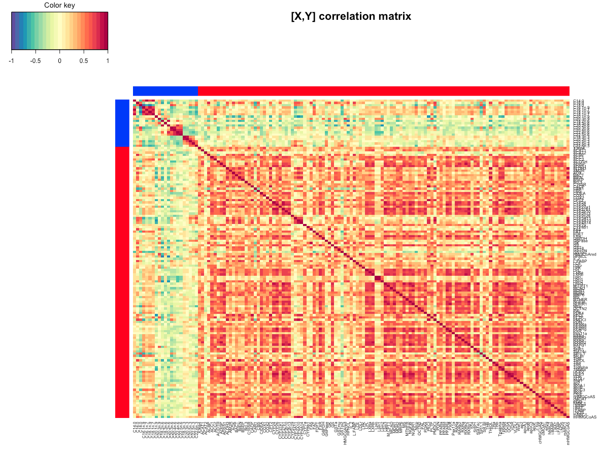
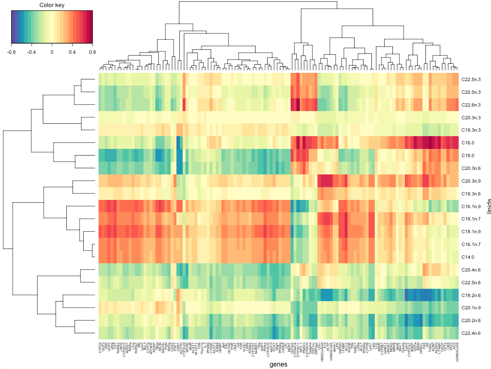

```{r global_options, include=FALSE}
library(knitr)
knitr::opts_chunk$set(dpi = 100, echo= TRUE, warning=FALSE, message=FALSE, #dev = 'jpeg',
                      fig.show=TRUE, fig.keep = 'all')
```

# Case study with rCCA on Nutrimouse data set

Here, we illustrate regularized Canonical Correlation Analysis (rCCA) using the nutrimouse data set, see  *?nutrimouse*. The nutrimouse dataset contains the expression levels of genes potentially involved in nutritional problems and the concentrations of hepatic fatty acids for forty mice. The data sets come from a nutrigenomic study in the mouse from our collaborator [2], in which the effects of five regimens with contrasted fatty acid compositions on liver lipids and hepatic gene expression in mice were considered. 

## To begin...

Load the latest version of [mixOmics](https://www.rdocumentation.org/link/%20www.mixOmics.org%2FmixMC?package=mixOmics&version=6.0.0).

```{r}
library(mixOmics)
```

# Data

The Nutrimouse data set is implemented in mixOmics via *nutrimouse*, and contains the following:

**$gene:** expression levels of 120 genes measured in liver cells, selected among (among about 30,000) as potentially relevant in the context of the nutrition study. These expressions come from a nylon microarray with radioactive labelling.

**$lipid:** concentration (in percentage) of 21 hepatic fatty acids measured by gas chromatography.

Biological units (mice) were cross-classified with a two factors experimental design (4 replicates): 

**$genotype:** 2-levels factor, wild-type (WT) and PPAR -/- (PPAR).

**$diet:** 5-levels factor. Oils used for experimental diets preparation were corn and colza oils (50/50) for a reference diet (REF), hydrogenated coconut oil for a saturated fatty acid diet (COC), sunflower oil for an Omega6 fatty acid-rich diet (SUN), linseed oil for an Omega3-rich diet (LIN) and corn/colza/enriched fish oils for the FISH diet (43/43/14).

```{r}
data(nutrimouse)
X <- nutrimouse$lipid
dim(X)
```

Extract the two matching data sets, and check that the samples are ordered in the same way in both data sets:

```{r}
Y <- nutrimouse$gene
dim(Y)
#checking indiv names are matching
head(cbind(rownames(X), rownames(Y)))
```

Canonical Correlation Analysis (CCA) aims at highlighting correlations between two data sets, see [Methods: rCCA](http://mixomics.org/methods/rcca/). **mixOmics** proposes two ways of representing the correlation structure of the data, either by computing each correlation matrix of each data set separately, or by including the whole concatenated matrix X|Y using the *imgCor()* function:

```{r eval=FALSE}
imgCor(X, Y) 
```



This image provides a good insight into the correlation structure of each data set, X and Y, together but also separately (indicated by the red and blue rectangles), provided that the total number of variables p and q are not too large. The color key indicates the range of negative (blue) to positive (red) correlations.

# rCCA 

## Estimation of penalisation parameters (shrinkage method)

Before running rCCA, we need to tune the regularization parameters λ1 and λ2. We can use the cross-validation procedure (CV), or the shrinkage method which may output different results. The shrinkage estimates *method = "shrinkage"* can be used to bypass *tune.rcc()* to choose the shrinkage parameters - which can be long and costly to compute with very large data sets, see *?rcc*. 

```{r}
nutrimouse.shrink <- rcc(X, Y, ncomp = 3, method = 'shrinkage')
```

A scree plot can be useful to help choosing the number of the rCCA dimensions. 

```{r}
plot(nutrimouse.shrink, scree.type = "barplot")
```

## Estimation of penalisation parameters (CV method)

For CV we define the grid of values to be tested for the lambda parameters, then choose leave-one-out cross-validation. 

```{r}
grid1 <- seq(0, 0.2, length = 5) 
grid2 <- seq(0.0001, 0.2, length = 5)

cv <- tune.rcc(X, Y, grid1 = grid1, grid2 = grid2, validation = "loo")
par(mfrow=c(1,1)) # to close the mfrow figure
```

```{r}
nutrimouse.rcc <- rcc(X,Y, ncomp = 3,  lambda1 = cv$opt.lambda1, 
              lambda2 = cv$opt.lambda2)
```

A scree plot can be useful to help choosing the number of the rCCA dimensions. 

```{r}
plot(nutrimouse.rcc, scree.type = "barplot")
```

# Sample Plots 

rCCA is an unsupervised approach that focuses on maximising the correlation between the two data sets X and Y and therefore the information about the treatments or groups is not taken into account in the analysis. Here, we represent the different treatments to illustrate how the samples are clustered on the sample plot:

```{r}
plotIndiv(nutrimouse.rcc, comp = 1:2, ind.names = nutrimouse$diet, 
          group = nutrimouse$genotype, rep.space = "XY-variate",
          legend = TRUE, title = 'Nutrimouse, rCCA XY-space')
```

Projecting the samples into the XY -space shows an interesting clustering of the genotypes (comp 1), as well as some distinction between the five types of diets (comp 2). 

```{r}
plotIndiv(nutrimouse.rcc, comp = 1:2, ind.names = nutrimouse$diet, 
          group = nutrimouse$genotype, 
          legend = TRUE, title = 'Nutrimouse, each subspace')
```

We can also use the function plotArrow() to superimpose the two data sets (see 6.1.2 and ?plotArrow):

```{r}
col.nutri <- color.mixo(as.numeric(nutrimouse$genotype))
plotArrow(nutrimouse.rcc, col  = col.nutri, title = 'Nutrimouse, arrow plot')
```

We can visualize the samples projected in a 3D space, these 3D graphs are interactive in R. 

```{r}
 col.diet <- color.mixo(as.numeric(nutrimouse$diet))
 plotIndiv(nutrimouse.rcc, comp = 1:3, ind.names = FALSE, 
             col = col.diet, style = '3d')
```


# Variable Plots 

The correlation circle plot helps visualising the correlation between variables. Both 2D and 3D plots are available, see [here](http://mixomics.org/graphics/sample-plot/plotvar/) or *?plotVar*. 

```{r}
#cutoff = 0.5 so that only the variables outside the small circle of radius 0.5 are represented
plotVar(nutrimouse.rcc, comp = 1:2, cutoff = 0.5, var.names = c(TRUE, TRUE),
        cex = c(4, 4), title = 'Nutrimouse, rCCA comp 1 - 2')
```

Output from *network()* function can be imported into Cytoscape, see [here](). 
```{r eval=FALSE}
network(nutrimouse.rcc, comp = 1:3, interactive = FALSE, threshold = 0.55, lwd.edge = 2)
```


```{r CIM, eval=FALSE}
cim(nutrimouse.rcc, comp = 1:3, xlab = "genes", ylab = "lipids", 
    margins = c(5, 6))
```



# References 

1. González I., Déjean S., Martin P.G.P and Baccini, A. (2008) CCA: An R Package to Extend Canonical Correlation Analysis. Journal of Statistical Software, 23(12).

2. [Martin, P., Guillou, H., Lasserre, F., Déjean, S., Lan, A., Pascussi, J.-M., San Cristobal, M., Legrand, P., Besse, P., and Pineau, T. (2007). Novel aspects of PPARalpha-mediated regulation of lipid and xenobiotic metabolism revealed through a multrigenomic study. Hepatology, 54, 767–777.](http://onlinelibrary.wiley.com/doi/10.1002/hep.21510/full)
